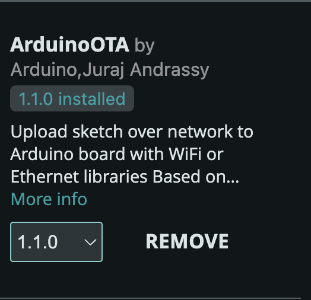
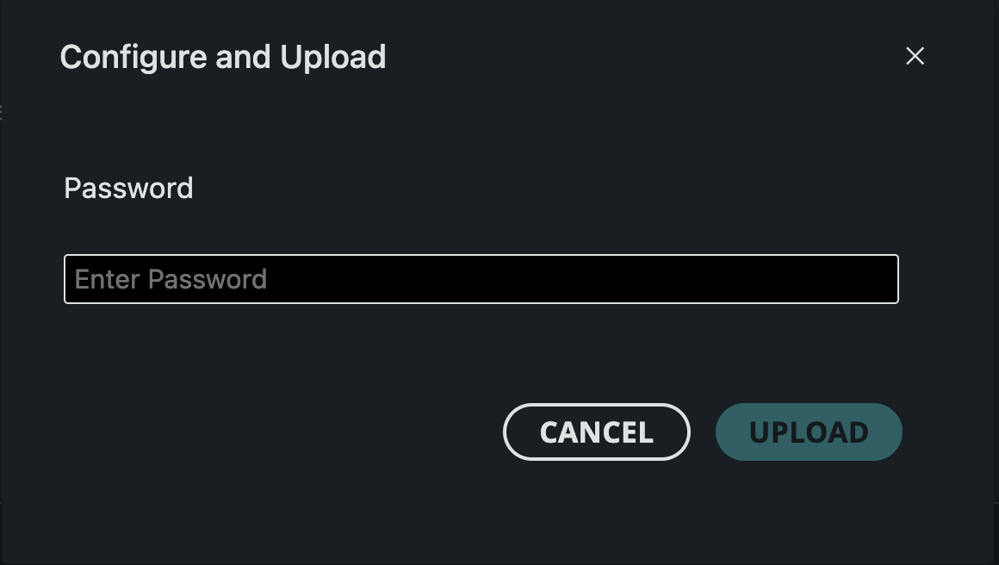

# ESP OTA
## Overview
ESP OTA allows uploading to ESP using WIFI instead of serial connection. 

## Project Structure 
```
ESP-OTA
|-- assets/             # Documentation Photos
|-- OTABlinkExample/    # Blink Example 
|-- Template/           # Template containing OTA methods
|-- README.md           # This file
```

## How to use
### 1️⃣ Install `ArduinoOTA` Library 

### 2️⃣ Clone the Repository
Run the following command to clone the repository
```bash
git clone https://github.com/AMansour5/ESP-OTA.git
```
### 3️⃣ Add your Code in the Specified Sections in the `OTATemplate.ino` 

## Notes

1) The first time to upload the ESP has to be done serially.
2) When the ESP connects to the WIFI, it will be displayed in the boards dropdown menu with its IP. 
3) In `OTATemplate.h` you can add the password, so no one on the network can upload to the ESP except you.
4) If when uploading it requires a password eventhough you didn't specify the need for it, just write the WIFI password. 
5) For more information about `ArduinoOTA` please refer to this repository [OTA Library](https://github.com/jandrassy/ArduinoOTA)